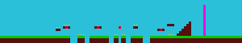
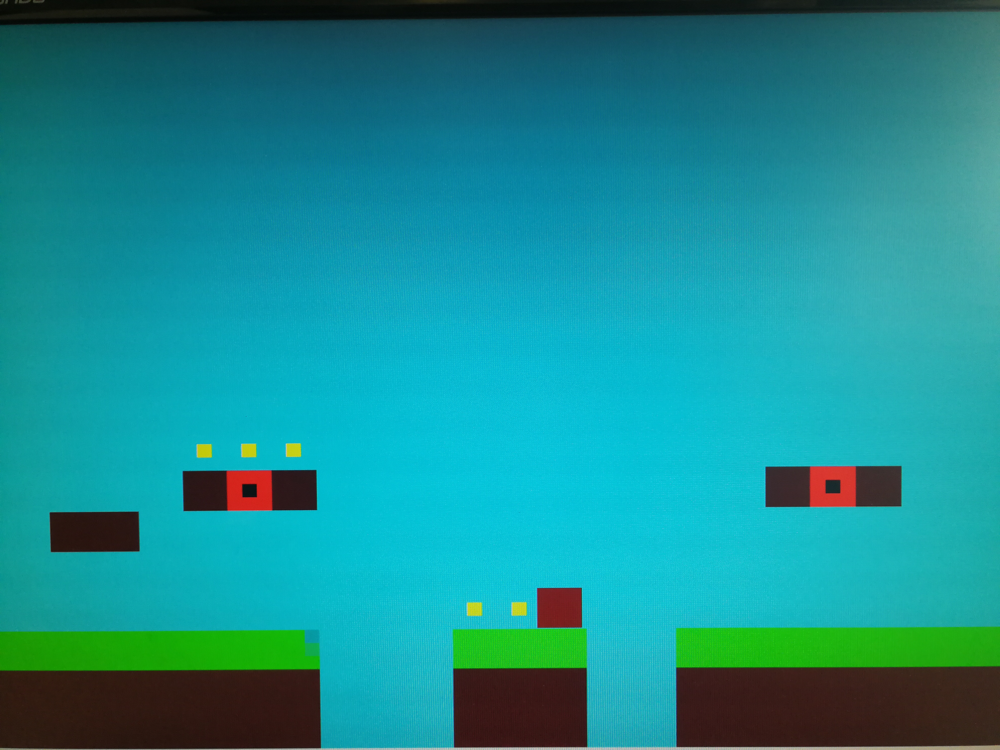
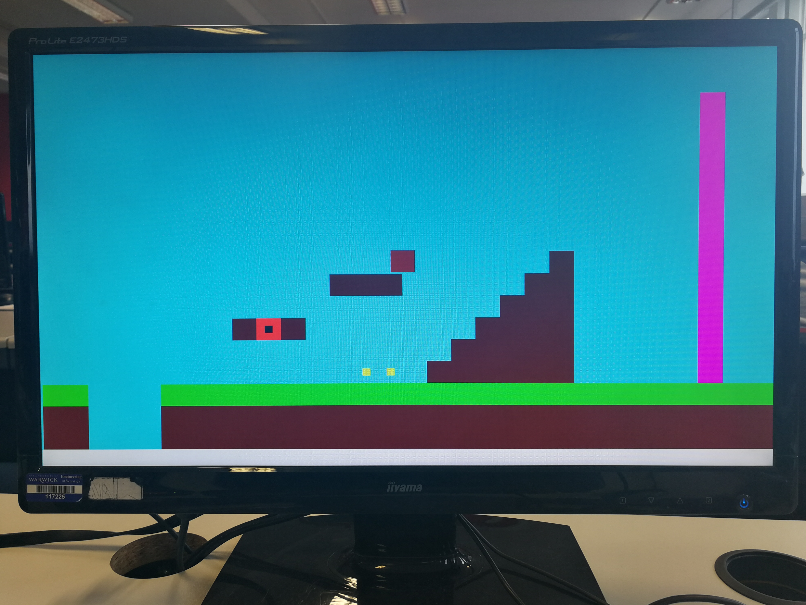
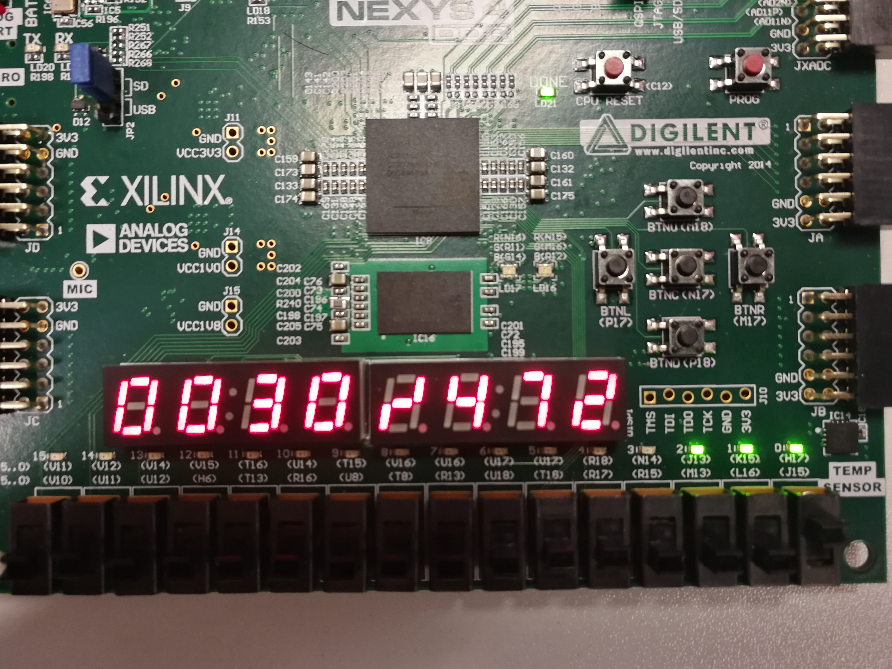

# University Verilog Project: Super Block Brothers

A Verilog project developed by 2 people in 2019 during a university lab, using the Nexys4DDR development board. The aim of this small platform game is to travel from one end of the level to the end as quickly as possible, collecting coins to increase score. Falling out of bounds causes the user to restart, and the number of lives is limited.

## Notale features

- Player controlled using buttons on the development board, including diagonal movement when 2 buttons are pressed.
- Gravity and collision systems which causes the player to fall and interact with level obbjects (very buggy, however). Includes recognizing transversable coins, which disappear when colliding with the player.
- VGA modules to output game to a screen, including a scrolling screen which allows levels to be longer than the screen dimensions. Scrolling screen recognized level boundaries and does not overflow.
- Python script which takes a game level image and converts it to a memory file, which is loaded and displayed by the development board.
- 7 segment LCD on development board used to show score, LEDs show how many lives the player has left.

## Contact

- If you would like further information, such as the lab report of this project, please contact the repo owner.

## Pictures

